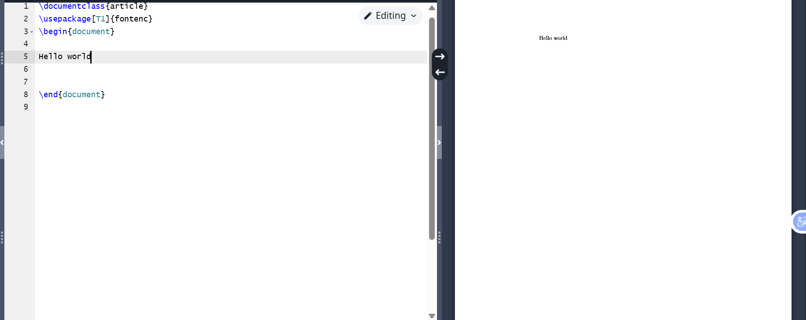

# Labotory work 1

## Create an account

{ #fig:001 width=70% }

## Login

{ #fig:002 width=70% }

## First document

{ #fig:003 width=70% }

## Conclusions

- We created our account and we can work freely on ovaleaf. 

## {.standout}

Спасибо за внимание!
