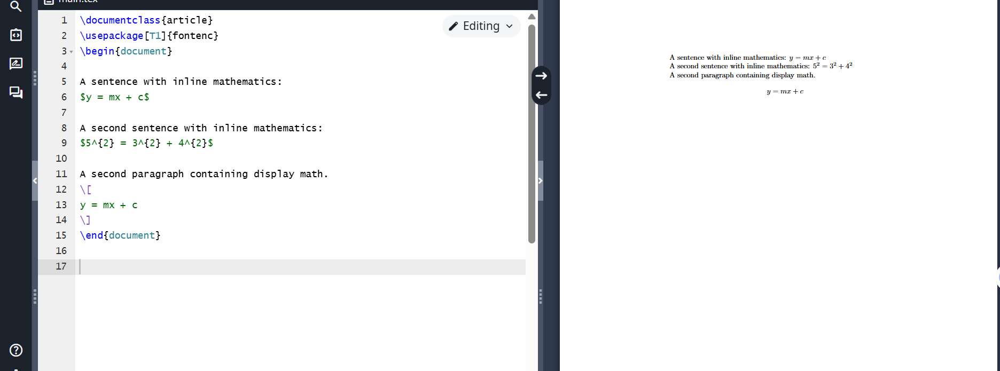
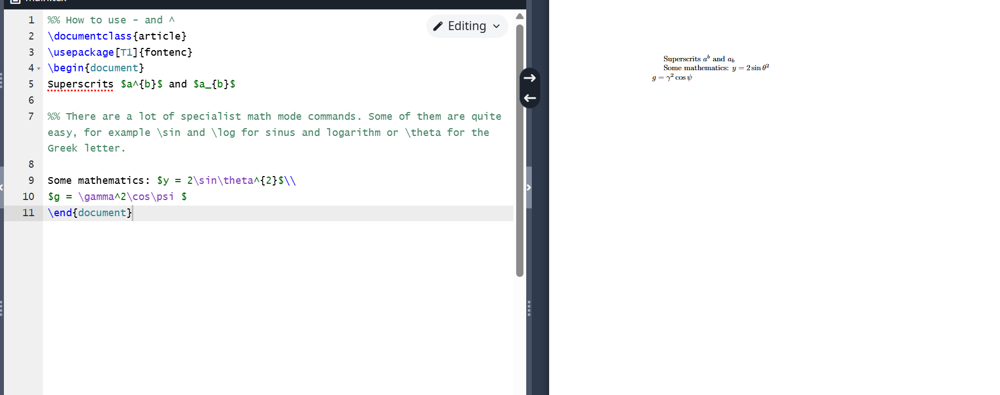
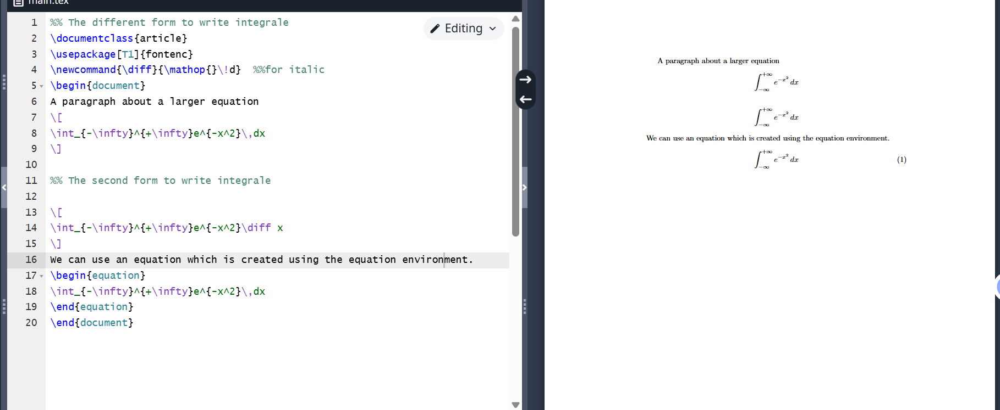
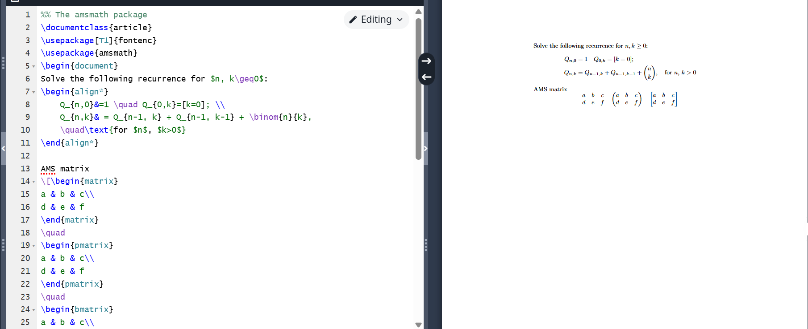
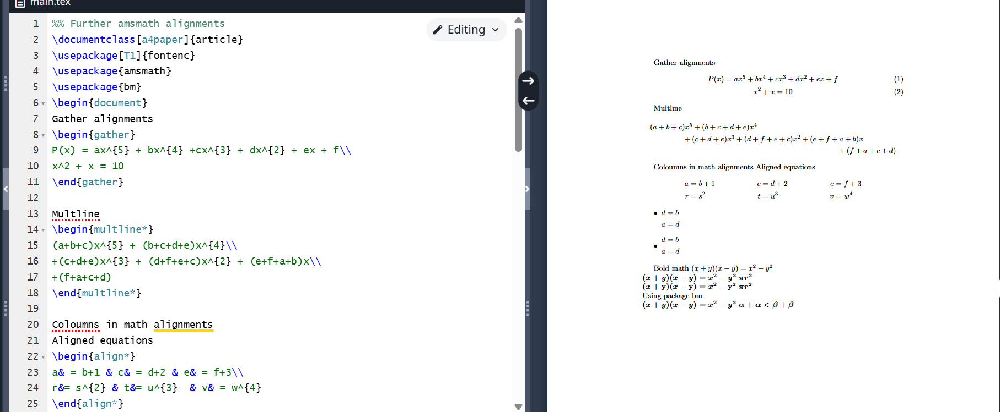
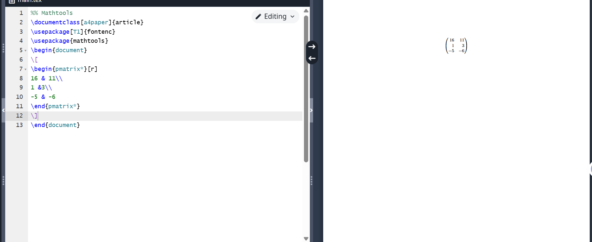
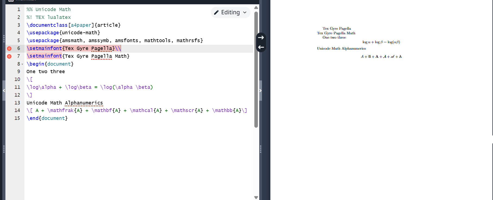

# Laboratory Work 3: LaTeX Study

## Introduction
This laboratory work focuses on learning LaTeX for scientific writing.

## Learning LaTeX

## Basic Commands

## Mathematical Expressions

## Advanced Features

## Packages and Extensions

## Customization

## Additional Features

## Conclusions

1. Got acquainted with LaTeX language
2. Continued studying its capabilities
3. Learned to write mathematical formulas
4. Explored various LaTeX packages
