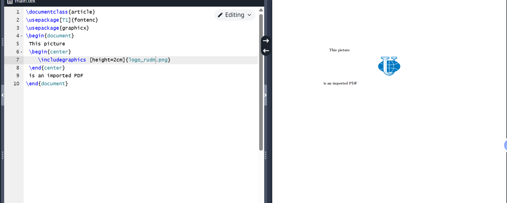
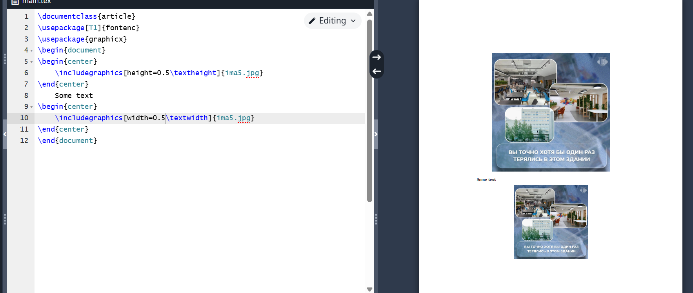
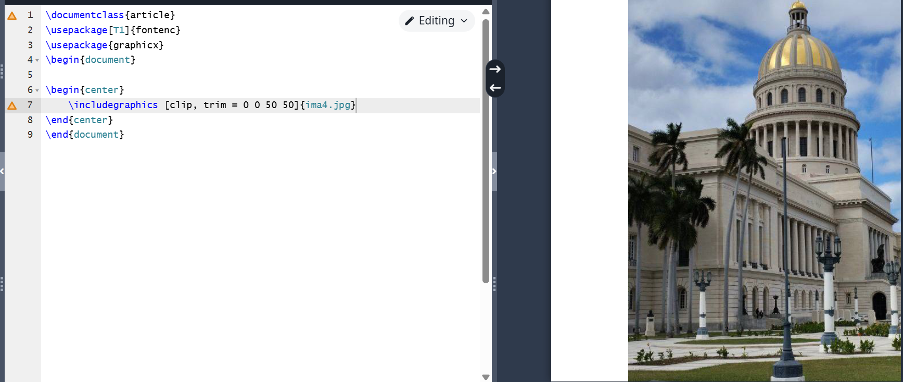
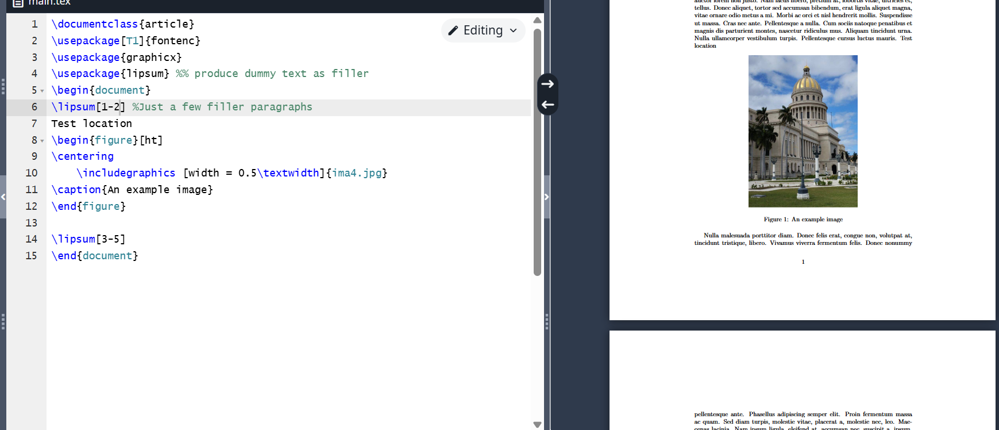
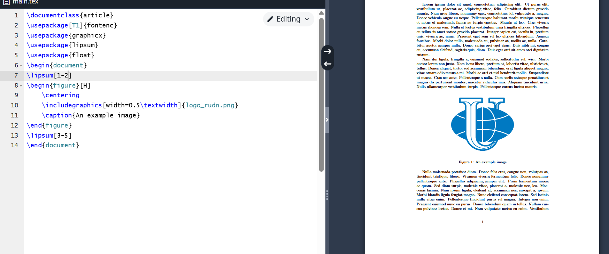
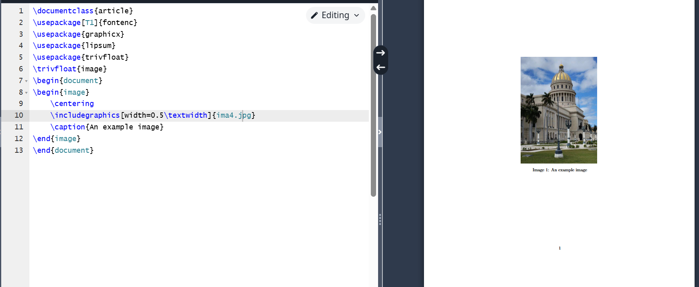
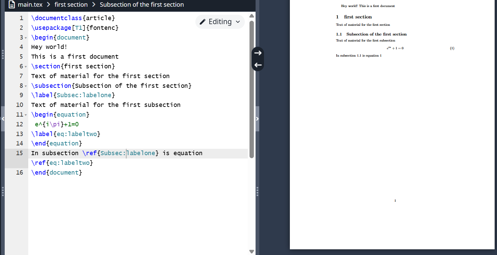
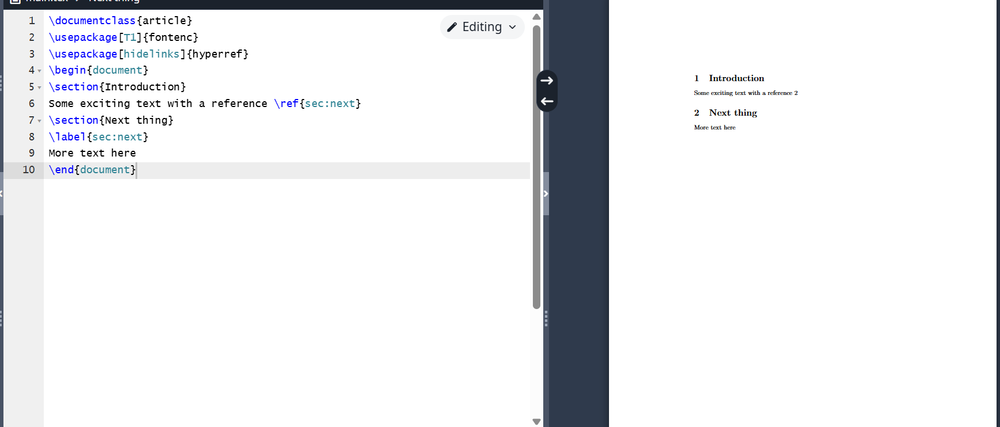

# Objective of the Work

To become familiar with the LaTeX language and continue studying its capabilities.

# Task

Launch several different programs, study a new package for working with graphics and new language commands.

# Execution of Laboratory Work

Start working with a new package. To add graphics from an external source to LaTeX, we use the graphicx package, which adds the '\ includegraphics command to LaTeX.

{ #fig:001 width=70% }

Try changing the image's height and width. LaTeX automatically scales the image to preserve its aspect ratio.

{ #fig:002 width=70% }

We can not only change the width and height of the image but also crop it and rotate it at various angles.

{ #fig:003 width=70% }

Graphical elements can be moved to another place in the document. This is called a floating element. Let's try implementing this in a program.

{ #fig:004 width=70% }

Often, it is required for a figure to appear in the output exactly where it is placed in the input data. The float package allows this to be done using the H option.

{ #fig:005 width=70% }

If we need several environments, this can be done using the trivfloat package. It provides a single command \ trivfloat for creating new types of floating environments.

{ #fig:006 width=70% }

For LaTeX to remember a place in the document, it needs to be marked and then referenced from other places.

{ #fig:007 width=70% }

Turn cross-references into hyperlinks using the hyperref package. It should be noted that if we place a reference outside of a chapter, it will neither display nor function.

{ #fig:008 width=70% }

The programs work correctly.

# Conclusions

I became familiar with the LaTeX language and continued studying its capabilities.

