# Objective
To become familiar with LaTeX and continue exploring its capabilities.

# Task
Launch several different programs, study a new graphics package, and learn new commands in the language.

# Laboratory Work Execution
We begin working with a new package. We will study the array package for working with tables.

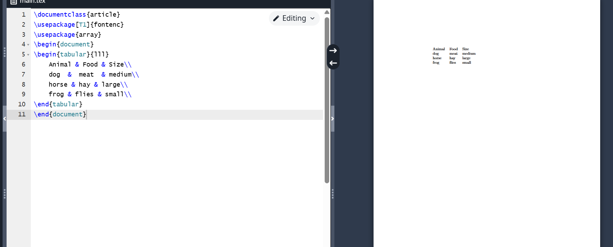{ #fig:001 width=70% }

 
If a table column contains a lot of text, we may encounter problems displaying it correctly using only l, c, and r. Let's see what happens in the following example (fig. [-@fig:002]). As you can notice, the text is not fully displayed and goes beyond the page margins.

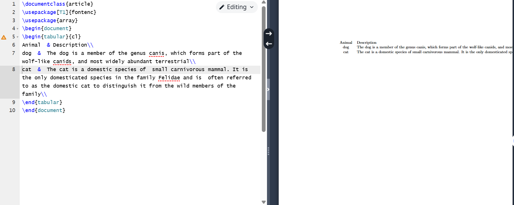{ #fig:002 width=70% }

To solve this problem, you can use a column of type p. Its content is placed as paragraphs with the width you specify (fig. [-@fig:003]).

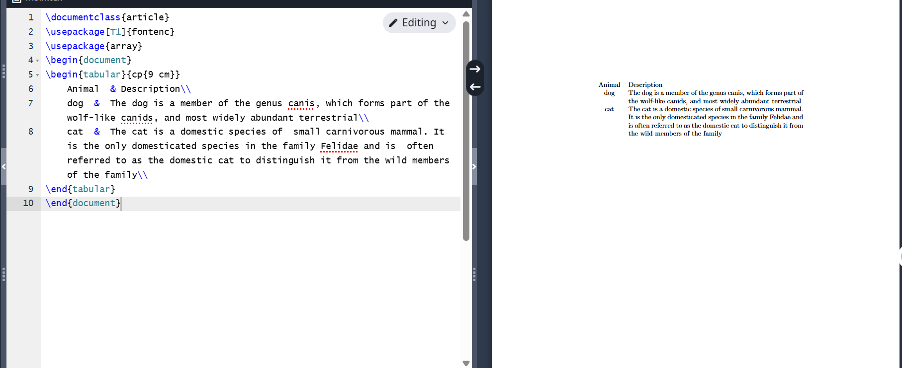{ #fig:003 width=70% }

If your table has many columns of the same type, it is inconvenient to specify that many column definitions in the preamble. You can simplify the task by using {num}{string} (fig. [-@fig:004]). 

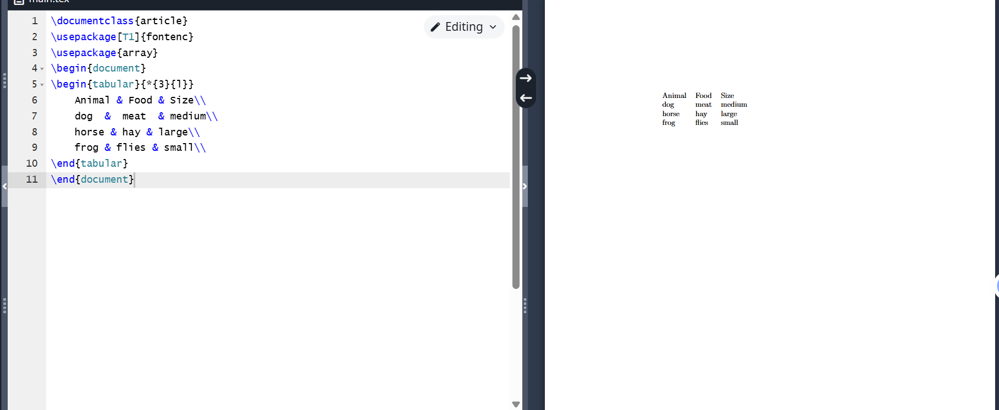{ #fig:004 width=70% }

The booktabs package provides four different types of lines. Each of these commands must be used at the beginning of a row or after another command. Here are three commands for creating lines: toprule, midrule, and bottomrule. Their names should make it clear where to use them (fig. [-@fig:005]).

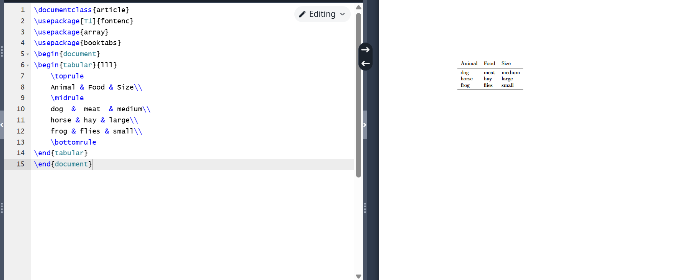{ #fig:005 width=70% }

The fourth command provided by the booktabs package is cmidrule. It can be used to create a rule that does not span the entire table width, but only a specified range of columns (fig. [-@fig:006]).

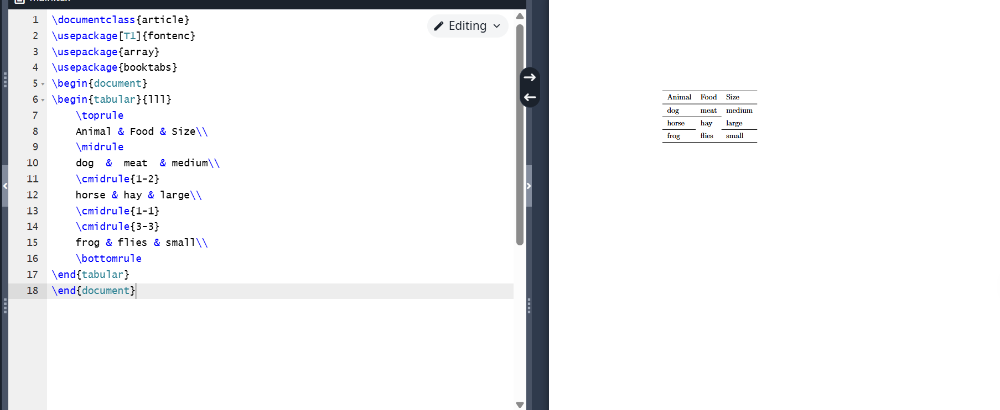{ #fig:006 width=70% }

Here we solve the problem described in Program 2, but with a small space between the table rows using the \ addlinespace command (fig. [-@fig:007]).

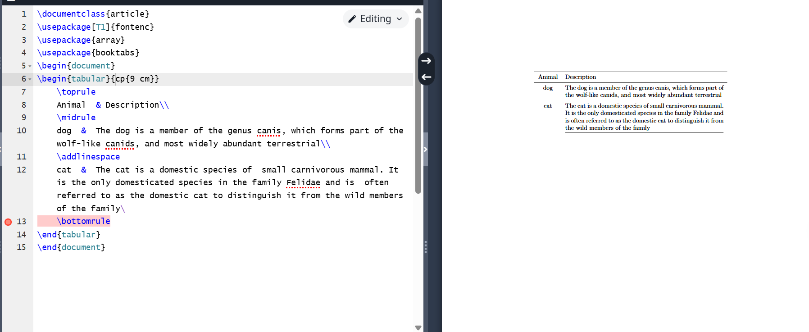{ #fig:007 width=70% }

In LaTeX, you can merge cells horizontally using the \ multicolumn command (fig. [-@fig:008]).

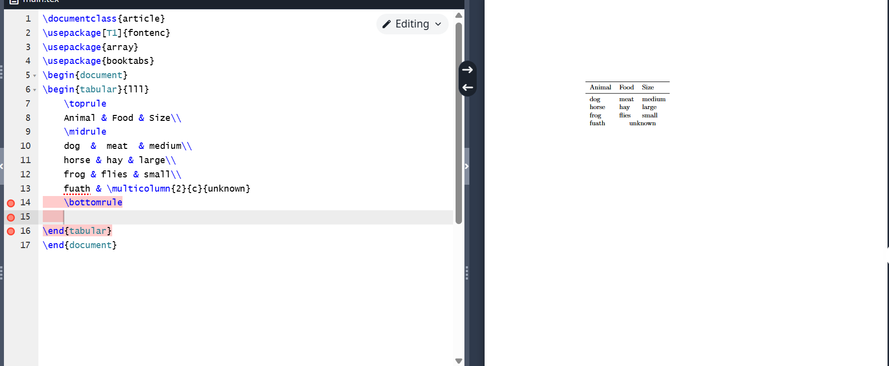{ #fig:008 width=70% }

Vertical cell merging is not supported in LaTeX. Usually, leaving cells empty is enough for the reader to understand what is meant, without the need to explicitly merge cells in rows (fig. [-@fig:009]).

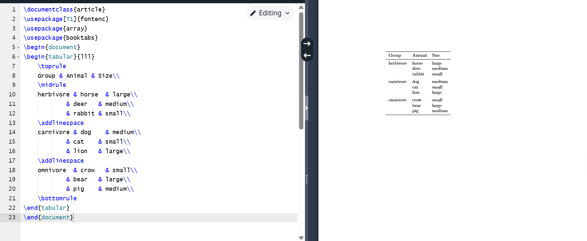{ #fig:009 width=70% }

Since > and < can be used to add elements before and after a cell's content in a column, we can use them to add commands that affect the appearance of the column. For example, if we want to emphasize the first column in italics and add a colon after it (fig. [-@fig:010]).

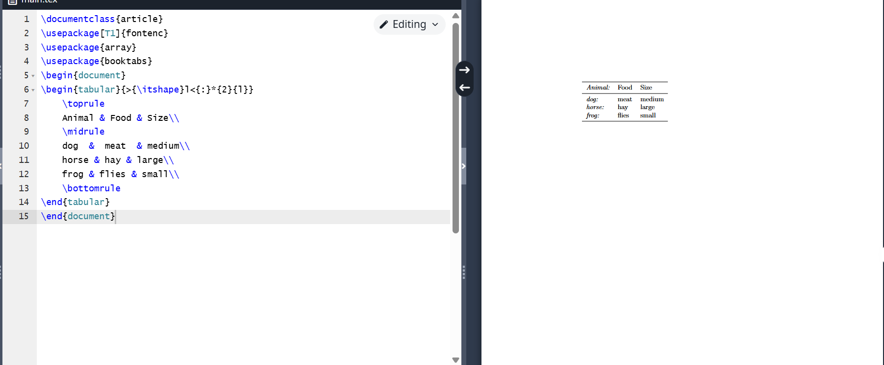{ #fig:010 width=70% }

Usually, LaTeX adds a small amount of free space on both sides of each column to balance the appearance and separate the columns. This space is defined by the tabcolsep length (fig. [-@fig:011]).

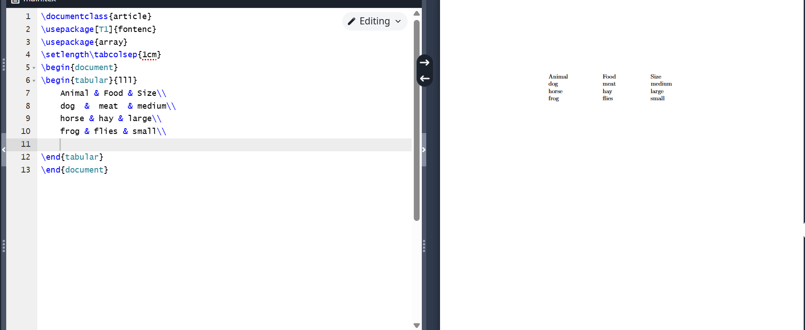{ #fig:011 width=70% }

Sometimes you have to use vertical lines (fig. [-@fig:012]).

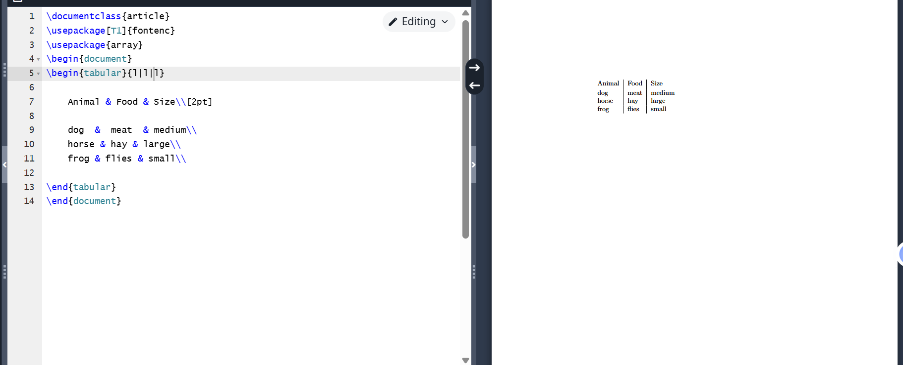{ #fig:012 width=70% }

The tabular environment accepts an additional width argument, which specifies the total width of the table. For the table, you need to add stretchable space using the \ extracolsep command (fig. [-@fig:013]).

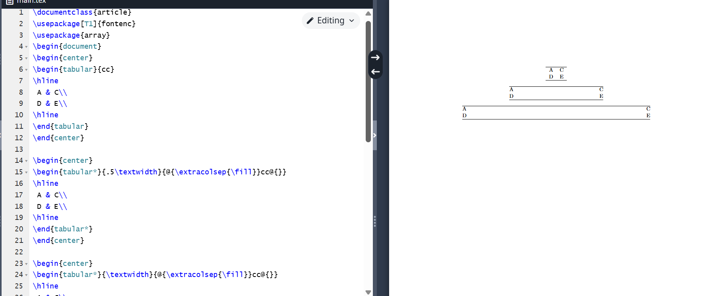{ #fig:013 width=70% }

Tables form an unbreakable block, so they must be compact enough to fit on one page. They are often placed in a floating table. Several packages provide variants with similar syntax that allow breaking a table across pages (fig. [-@fig:014]).

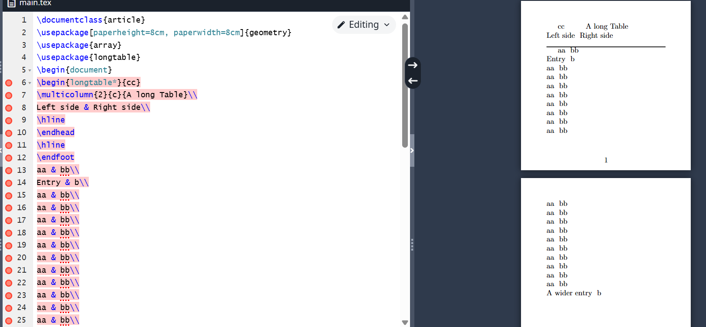{ #fig:014 width=70% }

 The threeparttable package simplifies the layout of tables with footnotes, allowing notes to be placed in a block of the same width as the table (fig. [-@fig:015]).

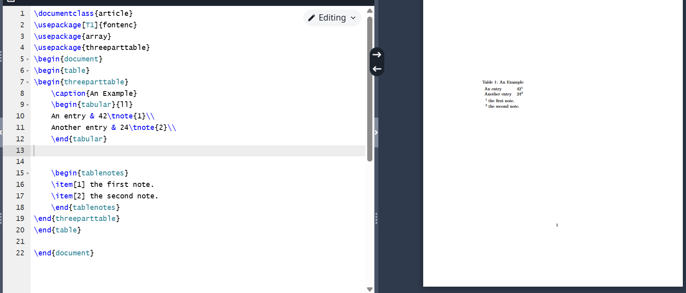{ #fig:015 width=70% }

The following example demonstrates the use of the extrarowheight parameter.

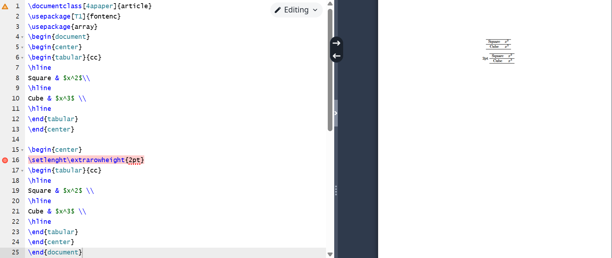{ #fig:016 width=70% }

The programs work correctly. 

# Conclusion

I became familiar with the LaTeX language and continued studying its capabilities.

