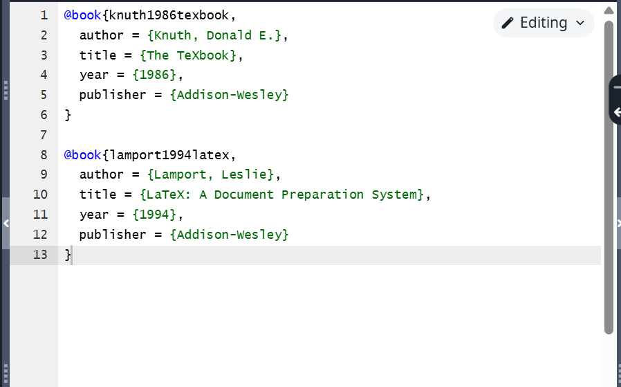
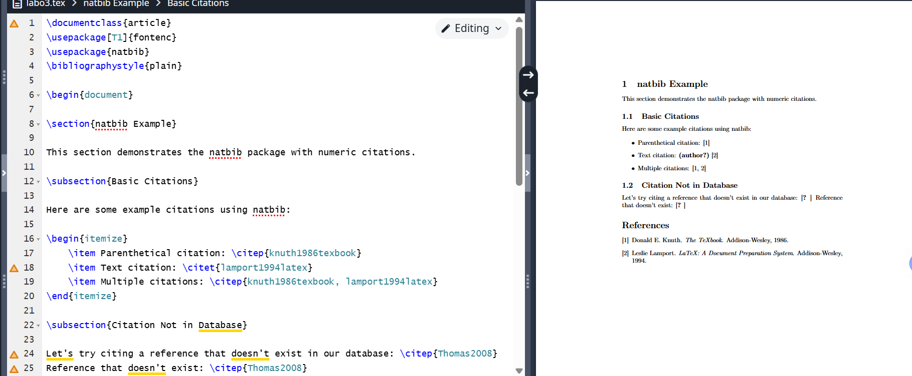
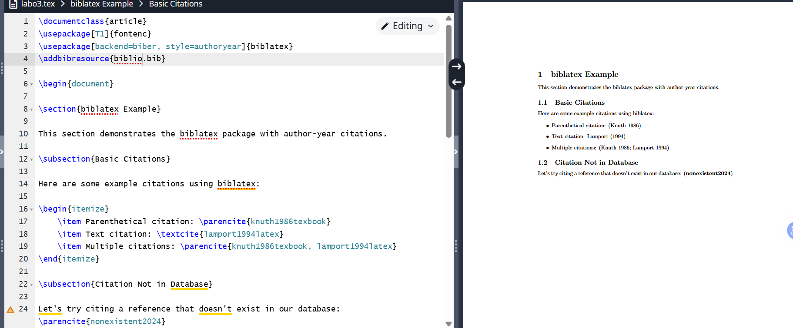

# Laboratory work 6

## Working with bib

{ #fig:001 width=70% }

## BibTeX

{ #fig:002 width=70% }

## biblatex

{ #fig:003 width=70% }

## Conclusion

- Got acquainted with LaTeX
- Learned a new package
- Learned how to work with bibliographies
## {.standout}

Thank you for attention!
