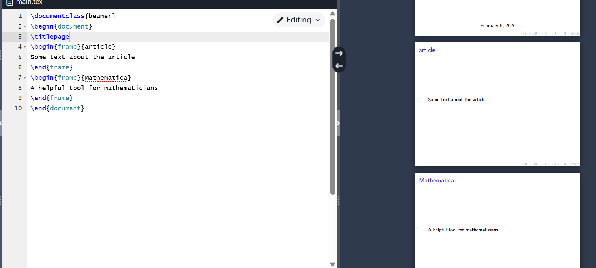
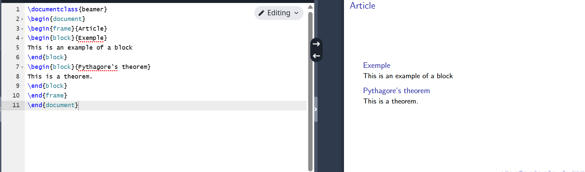
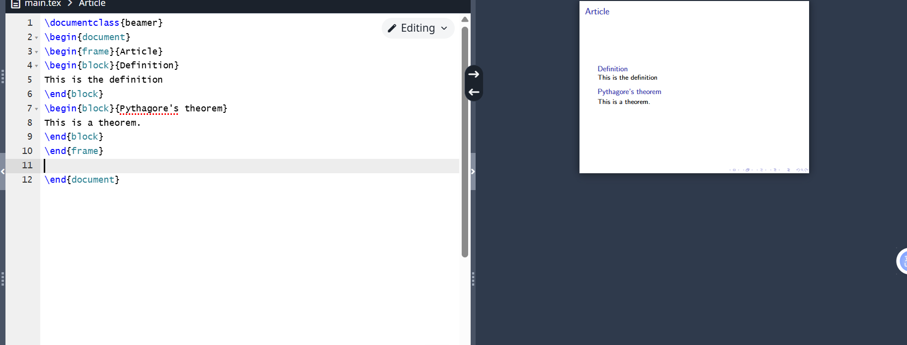
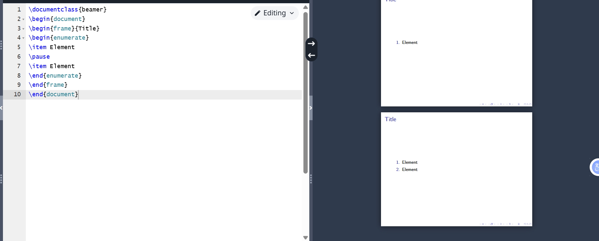
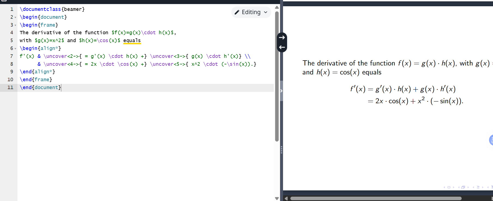
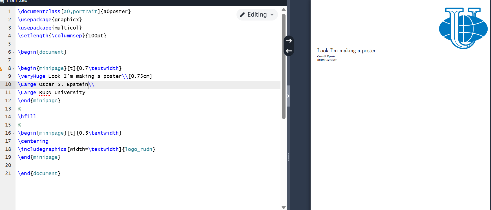

# Laboratory work 7

## Document class beamer

{ #fig:001 width=70% }

## Slide

{ #fig:002 width=70% }

## The pause and block command

{ #fig:003 width=70% }

{ #fig:004 width=70% }

## command uncover

{ #fig:005 width=70% }

## Poster

{ #fig:006 width=70% }

## Conclusion

- I got acquainted with LaTeX
- I learned about a new package

Thank you for your attention!