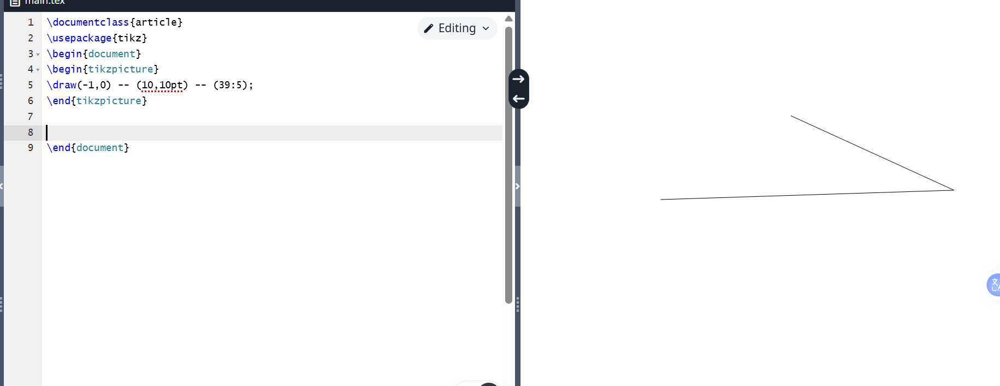
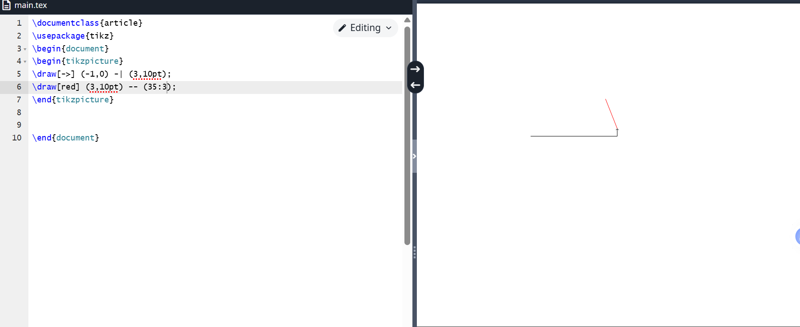
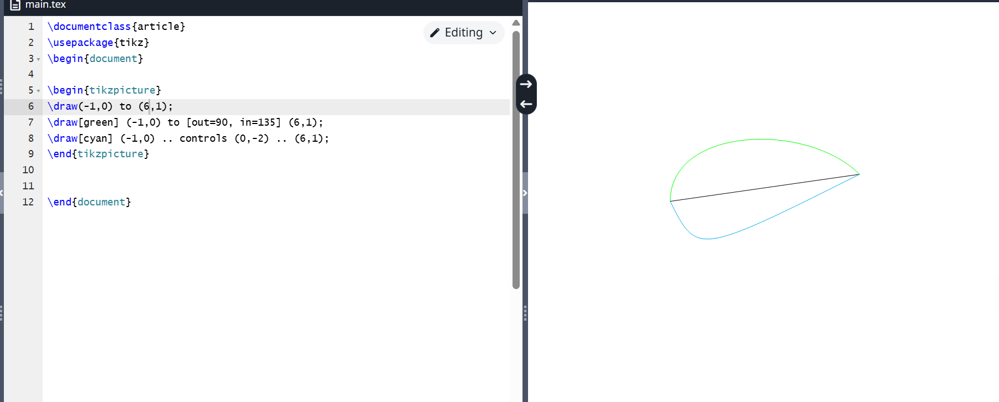
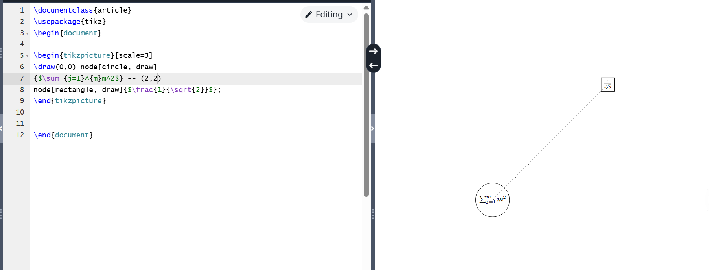
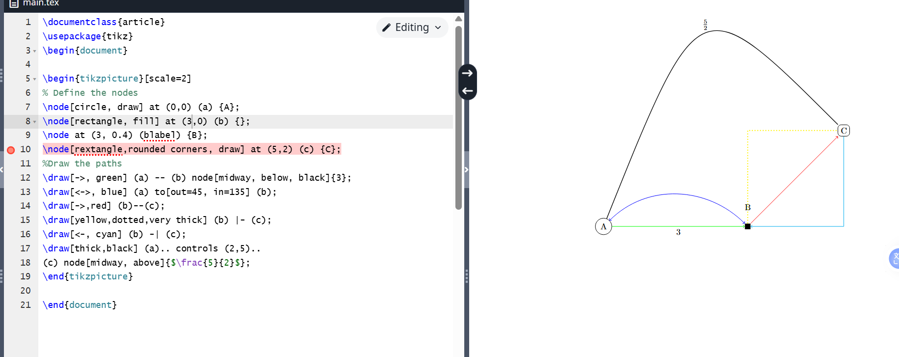
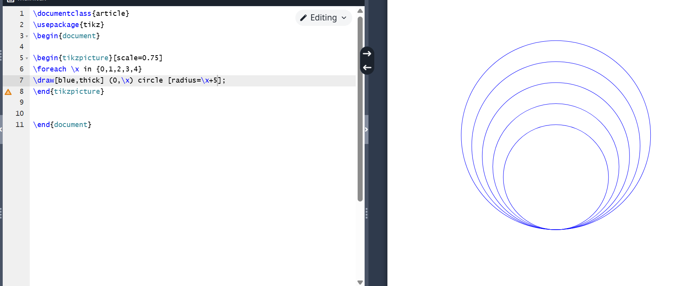

# Purpose of the work

To become familiar with the LaTeX language and further explore its capabilities. 

# Task

Run several different programs, learn a new graphics package and new language commands.

# Completing the Lab

We're starting to work with the new package. The graph consists of several points and lines. We begin constructing the graph by determining the coordinates of the points. See the figure below.

{ #fig:001 width=70% }

 
In addition to drawing straight lines, we can create other types of lines that can be customized with color, thickness, or pattern. See the image below.

{ #fig:002 width=70% }

We can draw not only straight lines, but also curved lines. See the drawing below.

{ #fig:003 width=70% }

The next step in the graph layout is to add labels, text fragments, and numbers to the image. See the image below.

{ #fig:004 width=70% }

Nodes can also be assigned mathematical formulas, and, as mentioned earlier, they can be outlined with a simple line. See the image below.

{ #fig:005 width=70% }

Let's try creating a complex graph with many different elements. See the figure below.

{ #fig:006 width=70% }

TikZ also supports for loops using the foreach command. See the image below.

{ #fig:007 width=70% }

The programs work correctly.

# Conclusions

I became familiar with LaTeX and continued exploring its capabilities.

